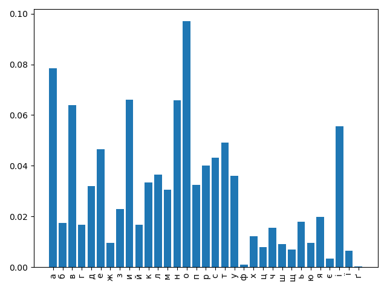

#+title: Lab 1

* Завдання 1

#+name: frequencies
#+begin_src rust :results output verbatim

static ALPHABET: [char; 33] = [
    'а','б','в','г','ґ','д','е','є','ж','з','и','і','ї','й','к','л',
    'м','н','о','п','р','с','т','у','ф','х','ц','ч','ш','щ','ь','ю','я'
];

fn char_to_num(c: char) -> Option<usize> {
    ALPHABET.iter().position(|&x| x == c)
}

fn frequencies(text: &str) -> [f64; 33] {
    let mut res = [0u32; 33];
    let mut count = 0usize;

    for ch in text.chars() {
        let c = ch.to_lowercase().next().unwrap();
        if ALPHABET.contains(&c) {
            count += 1;
            let idx = char_to_num(c).unwrap();
            res[idx] += 1;
        }
    }
    res.map(|c| c as f64 / count as f64)
}

#+end_src

#+RESULTS: frequencies

#+begin_src rust :noweb yes
<<frequencies>>

use std::fs;

fn main() {
    let text = fs::read_to_string("/Users/shwei/repos/AlgebraC2/Crypto/LW1/misto.txt").unwrap();
    let occurences = frequencies(&text);
    println!("{:?}", occurences);
    // assert!(occurences.iter().sum::<f64>() == 1f64);

}

#+end_src

#+RESULTS:
: [0.07853187621973749, 0.017343520233693645, 0.06390866506473443, 0.016698779704560053, 0.0002430175840580465, 0.031939453904771826, 0.04648331237926614, 0.0033427316664310885, 0.009566957543836156, 0.022868450614115354, 0.06611070194885224, 0.05568822331828112, 0.0066036308810875285, 0.016738456044814425, 0.033330605584940845, 0.03648983417769545, 0.03060037742118667, 0.06581312939694442, 0.09696897558169235, 0.03254203832238514, 0.03998135212008044, 0.04322985247840739, 0.04909203175099129, 0.036001319238313456, 0.0009571917086367953, 0.01225254982480416, 0.007823678343909558, 0.015439055901483647, 0.009167714370026508, 0.00691856183185663, 0.017881630598393605, 0.009495044177125102, 0.019947280062887]

#+name: freq_table
| літера |               частота |
|--------+-----------------------|
| о      |   0.09696897558169235 |
| а      |   0.07853187621973749 |
| и      |   0.06611070194885224 |
| н      |   0.06581312939694442 |
| в      |   0.06390866506473443 |
| і      |   0.05568822331828112 |
| т      |   0.04909203175099129 |
| е      |   0.04648331237926614 |
| с      |   0.04322985247840739 |
| р      |   0.03998135212008044 |
| л      |   0.03648983417769545 |
| у      |  0.036001319238313456 |
| к      |  0.033330605584940845 |
| п      |   0.03254203832238514 |
| д      |  0.031939453904771826 |
| м      |   0.03060037742118667 |
| з      |  0.022868450614115354 |
| я      |     0.019947280062887 |
| ь      |  0.017881630598393605 |
| б      |  0.017343520233693645 |
| й      |  0.016738456044814425 |
| г      |  0.016698779704560053 |
| ч      |  0.015439055901483647 |
| х      |   0.01225254982480416 |
| ж      |  0.009566957543836156 |
| ю      |  0.009495044177125102 |
| ш      |  0.009167714370026508 |
| ц      |  0.007823678343909558 |
| щ      |   0.00691856183185663 |
| ї      | 0.0066036308810875285 |
| є      | 0.0033427316664310885 |
| ф      | 0.0009571917086367953 |
| ґ      | 0.0002430175840580465 |

#+begin_src python :var data=freq_table :results graphics file output :file hist.png
import matplotlib.pyplot as plt

chars = [row[0] for row in data]
freqs = [float(row[1]) for row in data]

data = sorted([(chars[i], freqs[i]) for i in range(len(chars))], key=lambda x: x[0])

chars = [c[0] for c in data]
freqs = [c[1] for c in data]

plt.bar(chars, freqs)
plt.xticks(rotation=90)
plt.tight_layout()
plt.plot()
plt.savefig("hist.png")

#+end_src

#+RESULTS:

* Завдання 2

#+name: vigenere
#+begin_src rust results: none dir: /Users/shwei/repos/AlgebraC2/Crypto/LW1/ :noweb yes
<<frequencies>>

fn vigenere_enc(text: &str, key: &str) -> String {
    let mut result = String::with_capacity(text.len());

    let key: Vec<_> = key.chars().collect();

    for (i, t) in text.chars().enumerate() {
        let k = key[i % key.len()];
        let t_idx = char_to_num(t).unwrap();
        let k_idx = char_to_num(k).unwrap();
        let x_idx = (t_idx + k_idx) % 33;
        let x = ALPHABET[x_idx];
        result.push(x);
    }
    result
}

fn vigenere_dec(text: &str, key: &str) -> String {
    let mut result = String::with_capacity(text.len());
    let key: Vec<_> = key.chars().collect();
    for (i, t) in text.chars().enumerate() {
        let k = key[i % key.len()];
        let t_idx = char_to_num(t).unwrap();
        let k_idx = char_to_num(k).unwrap();
        let x_idx = (t_idx + 33 - k_idx) % 33 ;
        let x = ALPHABET[x_idx];
        result.push(x);
    }
    result
}
#+end_src

#+begin_src rust :noweb yes
<<vigenere>>

fn main() {
    let text = fs::read_to_string("/Users/shwei/repos/AlgebraC2/Crypto/LW1/text2.txt").unwrap();
    let text: String = text.to_lowercase()
        .chars()
        .filter(|c| ALPHABET.contains(&c))
        .collect();

    let key = "артемкотенко";
    assert!(key.chars().all(|c| ALPHABET.contains(&c)));

    let encoded = vigenere_enc(&text, key);
    fs::write("/Users/shwei/repos/AlgebraC2/Crypto/LW1/output.txt", encoded);

    let text2 = fs::read_to_string("/Users/shwei/repos/AlgebraC2/Crypto/LW1/output.txt").unwrap();
    let decoded = vigenere_dec(&text2, key);
    fs::write("/Users/shwei/repos/AlgebraC2/Crypto/LW1/output2.txt", decoded);

}

#+end_src

#+RESULTS:

* Завдання 3

#+name: ioc
#+begin_src rust :noweb yes
<<vigenere>>

static FREQUENCIES_UKR: [f64; 33] =  [0.07853187621973749, 0.017343520233693645, 0.06390866506473443, 0.016698779704560053, 0.0002430175840580465, 0.031939453904771826, 0.04648331237926614, 0.0033427316664310885, 0.009566957543836156, 0.022868450614115354, 0.06611070194885224, 0.05568822331828112, 0.0066036308810875285, 0.016738456044814425, 0.033330605584940845, 0.03648983417769545, 0.03060037742118667, 0.06581312939694442, 0.09696897558169235, 0.03254203832238514, 0.03998135212008044, 0.04322985247840739, 0.04909203175099129, 0.036001319238313456, 0.0009571917086367953, 0.01225254982480416, 0.007823678343909558, 0.015439055901483647, 0.009167714370026508, 0.00691856183185663, 0.017881630598393605, 0.009495044177125102, 0.019947280062887];

fn index_of_coincidence(text: &str) -> f64 {
    let mut counts = [0f64; 33];
    let mut N = 0f64;
    for c in text.chars() {
        let idx = char_to_num(c).unwrap();
        counts[idx] += 1.0;
        N += 1.0
    }
    let mut res = 0f64;
    for &freq in &counts {
        let freq = freq as f64;
        res += freq * (freq - 1f64);
    }
    res / (N * (N - 1f64))
}

fn avg_index_of_coincidence(text: &str, k: usize) -> f64 {
    let mut chunks = vec![String::new(); k];
    for (i, ch) in text.chars().enumerate() {
        let idx = i % k;
        chunks[idx].push(ch);
    }
    let mut total_ic = 0f64;
    for i in 0..k {
        total_ic += index_of_coincidence(&chunks[i]);
    }
    total_ic / k as f64
}

fn gen_probable_keylens(text: &str) -> [(usize, f64); 14] {
    let mut res = [(0usize, 0f64); 14];
    for k in 1..15 {
        res[k-1] = (k, avg_index_of_coincidence(text, k));
    }
    res
}

fn caesar_decrypt(text: &str, k: usize) -> String {
    let mut res = String::with_capacity(text.len());
    for ch in text.chars() {
        let orig_idx = char_to_num(ch).expect("Didn't get a valid char");
        let new_idx = (orig_idx + 33 - k) % 33;
        let decrypted_char = ALPHABET[new_idx];
        res.push(decrypted_char);
    }
    res
}

fn chi_square(text: &str) -> f64 {
    let mut counts_empirical = [0f64; 33];
    let freqs_theoretical = FREQUENCIES_UKR;
    let mut res = 0f64;
    for c in text.chars() {
        counts_empirical[char_to_num(c).unwrap()] += 1f64;
    }
    let total: f64 = counts_empirical.iter().sum();
    for i in 0..33 {
        let count_theoretical = freqs_theoretical[i] * total;
        let chi = (counts_empirical[i] - count_theoretical);
        res += (chi * chi) / count_theoretical;
    }
    res
}

fn crack_key(text: &str) -> String {
    let keylen_probable = gen_probable_keylens(text)
    .iter()
    .max_by(|a, b| a.1.partial_cmp(&b.1).expect("comp failed"))
    .expect("Cannot retrieve keylen")
    .0;
    let mut chunks = vec![String::new(); keylen_probable];
    for (i, ch) in text.chars().enumerate() {
        let idx = i % keylen_probable;
        chunks[idx].push(ch);
    }
    let mut key_probable = String::with_capacity(keylen_probable);
    for i in 0..keylen_probable {
        let mut chi_squares = [0f64; 33];
        for j in 0..33 {
            let deciphered_seq = caesar_decrypt(&chunks[i], j);
            chi_squares[j] = chi_square(&deciphered_seq);
        }
       // println!("{:?}", chi_squares);
        let probable_letter_idx = chi_squares
            .iter()
            .enumerate()
            .min_by(|a, b| a.1.partial_cmp(b.1).expect("Comp failed"))
            .map(|(idx, _)| idx)
            .expect("Cannot retrieve idx");
        let probable_letter = ALPHABET[probable_letter_idx];
        key_probable.push(probable_letter);
    }
    key_probable
}

fn vigenere_crack_key(text: &str) -> String {
    let key = crack_key(text);
    key
}

fn vigenere_crack(text: &str) -> String {
    let key = crack_key(text);
    let text_dec = vigenere_dec(text, &key);
    text_dec
}

fn check_consistency(text_true: &str, text_encrypted: &str, cracked_key: &str) -> f64 {
    let cracked_text = vigenere_dec(text_encrypted, cracked_key);
    let true_chars: Vec<_> = text_true.chars().collect();
    let cracked_chars: Vec<_> = cracked_text.chars().collect();

    let matches = true_chars
        .iter()
        .zip(cracked_chars.iter())
        .filter(|(x, y)| x == y)
        .count();

    (matches as f64 / true_chars.len() as f64) * 100f64
}
#+end_src

#+RESULTS: ioc

#+begin_src rust :noweb yes
<<ioc>>

use std::fs;

fn main() {
    let encrypted_text = fs::read_to_string("/Users/shwei/repos/AlgebraC2/Crypto/LW1/output.txt").unwrap();

    let real_text = fs::read_to_string("/Users/shwei/repos/AlgebraC2/Crypto/LW1/output2.txt").unwrap();
    //println!("{:?}", gen_probable_keylens(&text));

    let key = vigenere_crack_key(&encrypted_text);

    let s = vigenere_crack(&encrypted_text);
    fs::write("/Users/shwei/repos/AlgebraC2/Crypto/LW1/cracked.txt", s);

    println!("Probable key: {}", key);
    println!("Correspondence rate: {}", check_consistency(&real_text, &encrypted_text, &key));
}

#+end_src

#+RESULTS:
: Probable key: артемкотенко
: Correspondence rate: 100
